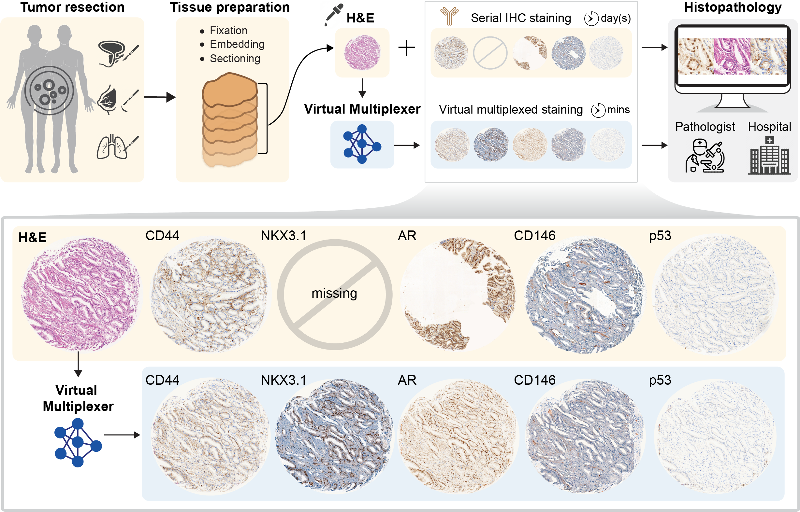

# Towards multiplexed histopathology with deep learning-based virtual staining

This repository contains the code to reproduce results of **VirtualMultiplexer**, a generative toolkit that translates real H&E images to matching immunohistochemistry (IHC) images for several markers under unpaired setting.

All the experiments are based on the EMPaCT dataset. The data needs to be downloaded separately. The entire pipeline was implemented in Python (version 3.9.1). 



## Installation 

### Cloning and handling dependencies 

Clone the repo:

```
git clone https://github.com/AI4SCR/VirtualMultiplexer && cd VirtualMultiplexer
```

Create a conda environment and activate it:

```
conda env create -f environment.yml
conda activate virtualmultiplexer
```

### Downloading the EMPaCT dataset 

European Multicenter Prostate Cancer Clinical and Translational Research Group (EMPaCT) [[1](https://www.sciencedirect.com/science/article/pii/S0022534712029710), [2](https://www.sciencedirect.com/science/article/pii/S2405456917300020), [3](https://www.frontiersin.org/journals/oncology/articles/10.3389/fonc.2020.00246/full)] contains prostate cancer tissue microarrays (TMAs) from 210 patients with 4 cores per patient for several clinically relevant markers.

All images from Hematoxylin & Eosin (H&E) and Immunohistochemistry (IHC) stainings are uploaded to Zenodo under a Creative Commons Attribution 4.0 International License and can be dowloaded from this [link](https://zenodo.org/records/10066853).

## Running the code 

The VirtualMultiplexer is a generative toolkit for unpaired stain-to-stain translation, trained on real H&E (source) and IHC (target) images.
VirtualMultiplexer outputs virtually stained IHC images that are consistent with the real IHC images in terms of appearance, from the macroscopic (image-level) to the microscopic (cell-level) scale.

### (Step 1: Training of VirtualMultiplexer)
VirtualMultiplexer can be **trained** in an end-to-end manner as follows:

```
cd bin
python main.py --base_path <PATH-TO-DATASET> --i2i_config_path <PATH-TO-TRAIN-CONFIG-FILE> --src_marker HE --dst_marker <DST-MARKER-NAME> --is_train True
```

The output of this script will be a **checkpoints** directory containing the finally trained VirtualMultiplexer model.


### (Step 3: Inference on VirtualMultiplexer)

The script includes the option to use a pretrained model.
For instance, running inference with a pretrained VirtualMultiplexer model: 

```
cd bin
python main.py --base_path <PATH-TO-DATASET> --i2i_config_path <PATH-TO-TEST-CONFIG-FILE> --src_marker HE --dst_marker <DST-MARKER-NAME> --is_test True
```

Details about our model architecture and implementation can be found in our [preprint](https://www.biorxiv.org/content/10.1101/2023.11.29.568996v1). If you use this code, please consider citing our work:

```
@article{pati2023multiplexed,
  title={Multiplexed tumor profiling with generative AI accelerates histopathology workflows and improves clinical predictions},
  author={Pati, Pushpak and Karkampouna, Sofia and Bonollo, Francesco and Comperat, Eva and Radic, Martina and Spahn, Martin and Martinelli, Adriano and Wartenberg, Martin and Kruithof-de Julio, Marianna and Rapsomaniki, Maria Anna},
  journal={bioRxiv},
  pages={2023--11},
  year={2023},
  publisher={Cold Spring Harbor Laboratory}
} 
```
